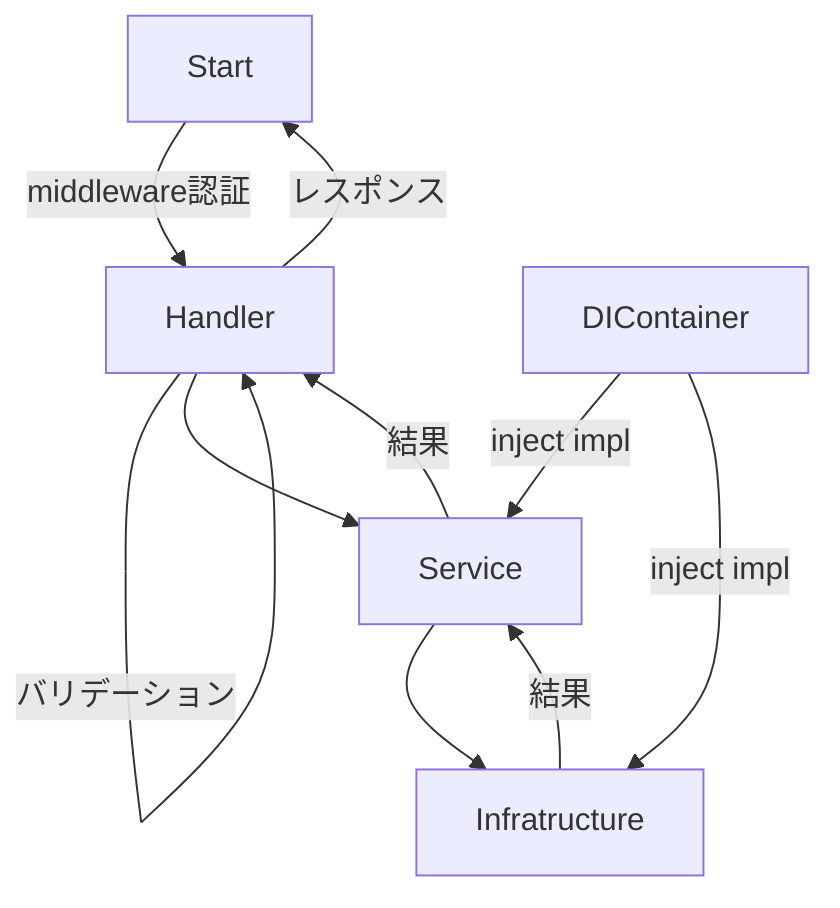

## 1. API設計

以下のSwaggerURLを確認お願いします。

[Swagger](https://app.swaggerhub.com/apis/QMDAKA/postprime/1.0.0-oas3)

## 2. アーキテクチャ
### 2.1 アーキテクチャ設計

- 呼び出す流れ： handler → serviceのインタフェース → infratructureのインタフェース
- handlerディレクトリ: Httpレクエストをバリデーションしたり、取り扱ったり、ビジネスロジックで処理する
    - formファイル: リクエストボディー、レスポンス、パラメタ、バリデーションを定義する
    - エンドポイントはそれぞれファイルで定義する。例：「/posts」エンドポイントにあたり、-> 「PostIndex」ファイルで定義する。
    - エラーハンドリング
- serviceディレクトリ: ビジネスロジックの処理を配置する。
    - インタフェス：ロジックインタフェースを定義する。handlerから呼び出すのはインタフェース経由である。
    - インタフェース上書き：実装を配置する。gowireでインタフェスと自動的に紐付ける。
- infratructureディレクトリ: システム外部を呼び出す
    - mysqlディレクトリ: SQLクエリ実行する。serviceディレクトリと同じで、インタフェスも定義する。
- domainディレクトリ:  
    - modelディレクトリ: DBテーブルをマッピングするモデルを配置する
    - dtoディレクトリ: DBから取得したデータ型を定義する
- serverディレクトリ：実行ファイル配置、routerハンドラー配置
- registryディレクトリ: wireのDIコンテナ配置
- middlewareディレクトリ: ハンドラー処理の以前の認証がある。
- seedディレクトリ: データベース初期化
- commonディレクトリ:　共通処理配置

### 2.2 流れ

## 3. データベース設計

